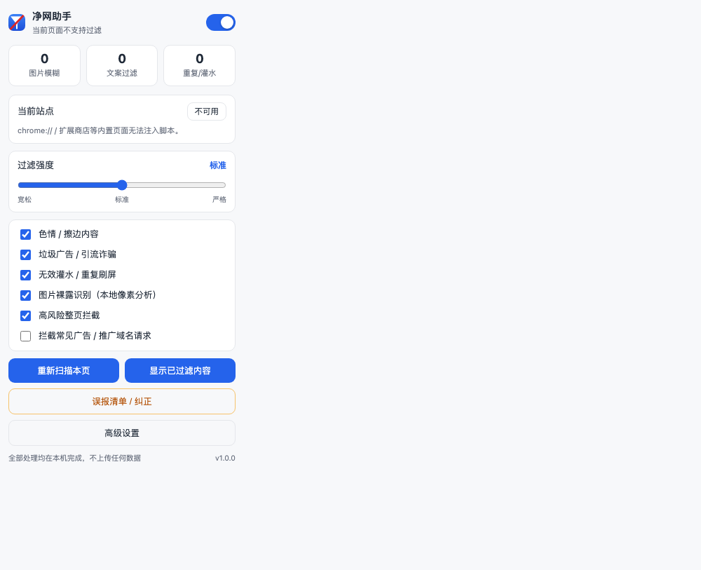
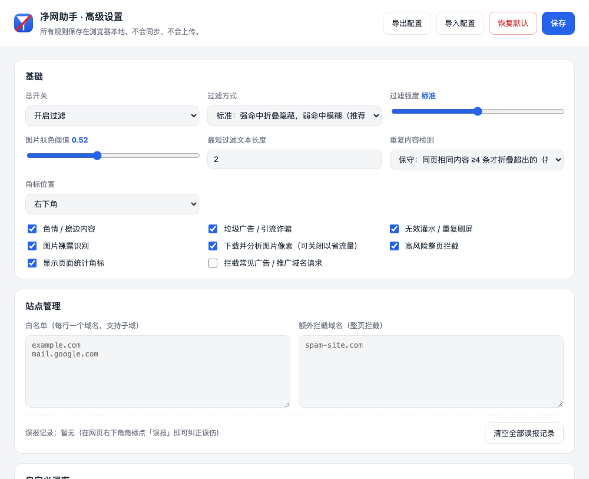

# 净网助手 · 黄暴 / 垃圾 / 无效信息过滤（Chrome 扩展）

一个**完全本地运行**的 Chrome 内容过滤器（Manifest V3）：
自动模糊疑似色情图片、折叠色情与诈骗引流文案、清理灌水与重复刷屏内容，并提供一键恢复。

> 隐私优先：不联网上传页面内容、不收集浏览记录、不含任何远程代码。所有判断都在你的浏览器里完成。

## 界面预览

| 工具栏弹窗 | 高级设置 |
| --- | --- |
|  |  |

---

## 一、安装（解压即用，无需开发者账号）

1. 打开 Chrome，地址栏输入 `chrome://extensions/`
2. 打开右上角的 **开发者模式**
3. 点击 **加载已解压的扩展程序**
4. 选择本目录 `content-filter-extension`（包含 `manifest.json` 的那一层）
5. 建议点击扩展图标旁的图钉，把「净网助手」固定到工具栏

安装后打开任意网页即可生效。

> Chrome 137 起，命令行 `--load-extension` 已被官方移除，因此自动化测试改用 CDP 的
> `Extensions.loadUnpacked`（见 `tools/verify-in-chrome.js`）。手动安装不受影响。

---

## 二、功能

| 模块 | 说明 | 默认 |
| --- | --- | --- |
| 色情 / 擦边内容 | 112 个强词 + 56 个弱词（中英双语），强命中直接折叠，弱词累积后模糊 | 开 |
| 垃圾广告 / 引流诈骗 | 94 个强词 + 31 个弱词 + 13 个低置信信号，覆盖加微信、刷单、博彩、贷款、代开发票等；含微信号 / QQ / 手机号 / 群号 / 可疑域名等正则 | 开 |
| 无效灌水 / 重复刷屏 | 33 个灌水词（沙发、打卡、前排…）+ 僵尸号群发检测（默认保守：同页相同内容 ≥4 条才折叠超出的；可切「严格」为 ≥3 条整组回溯） | 开 |
| 图片裸露识别 | 本地像素分析：肤色占比 + 皮肤区域平滑度 + 画面彩色度，命中即模糊，点击可查看 | 开 |
| 高风险整页拦截 | 命中内置成人/跳转站点名单，或域名本身含高风险关键词时，整页遮罩；可一键继续访问或加入白名单 | 开 |
| 广告 / 推广域名请求拦截 | 51 条 declarativeNetRequest 静态规则（广告联盟、统计、跳转推广域名） | 关（避免误伤站点） |

**交互方式**

- **鼠标悬停 / 点击** 被模糊的内容即可查看原文
- **右下角角标** 显示本页已过滤数量，点「显示」一键恢复全部内容
- **右键菜单**：重新扫描本页 / 显示被过滤内容 / 将本站加入白名单 / 加入拦截名单 / 打开设置
- **工具栏弹窗**：总开关、分类开关、过滤强度（1 宽松 ~ 5 严格）、当前站点白名单、实时统计

---

## 三、判定机制

文本按**加权打分**处理，而不是简单的关键词命中：

```
强色情词        +12  （命中即判定，无需累计）
擦边 / 软广词    +5 / +3（同类最多累计 2 条，防止“限时特价 秒杀”这类正常营销词被误拦）
强垃圾广告词     +10
低置信推广信号   +2  （“看我主页 / 扫码 / 点个关注”这类正常博主也在用，单条绝不触发，最多累计 3 条）
联系方式 / 可疑域名 +6 ~ +9（在“去分隔符压缩文本”上匹配，可识别“微 信 : a_b-1”这类混淆写法）
结构噪声        感叹号堆砌 / 字符重复 / 表情刷屏 / 全大写 / 长数字串，各自封顶
```

- 分数 ≥ **折叠阈值** → 折叠隐藏；≥ **模糊阈值** → 模糊处理
- 强度 3（标准）时：模糊 3 分、折叠 8 分；强度越高阈值越低
- 超过 500 字的文本块按**正文**处理，不做折叠（只可能被模糊），避免误伤长文章
- 输入框、按钮、导航栏、代码块、可编辑区域一律跳过
- 自定义**白名单词**命中后该文本块完全放行，用于纠正误伤（例如「性教育」「乳腺癌」）

**关于误伤**（重要）：本扩展宁可漏判也不误杀 ——
- 词库只用**完整词**做匹配，绝不拿单字去撞正常词：用 `我骚 / 比我骚 / 骚货` 而不是裸的「骚」
  （否则会误伤 骚扰 / 骚乱 / 骚动 / 离骚），用 `福不黑` 而不是「福利不黑 / 资源不黑」
  （否则会误伤「员工福利不黑心」「资源不黑不吹」）
- 语境依赖的推广语（看我主页、扫码、点个关注）被降级为低置信信号，**单条出现不会触发任何过滤**
- 重复内容检测默认**保守**：同页相同内容出现 ≥4 次才折叠超出的那几条，
  前面正常的条目保持不动；需要整组回溯刷屏请手动切成「严格」
- 任何被过滤/模糊的内容都可以一键恢复，白名单词与站点白名单可随时纠正

图片判定（`src/common/filter-engine.js` 的 `skinScore`）：对缩略后的像素做肤色分类统计，
结合肤色占比、区域平滑度与画面彩色度给出 0~1 的置信度，超过阈值才模糊。
这是**启发式**方法，不是机器学习模型，因此少数场景（沙滩、特写人像）可能误判——
所以设计上只做「先模糊、可点开」，绝不删除任何内容。

---

## 四、自定义

点击弹窗里的 **高级设置**（或右键菜单），可以：

- 调整过滤方式、强度、图片肤色阈值、最短过滤文本长度、角标位置
- 维护站点**白名单**与**自定义拦截域名**
- 追加自己的色情 / 垃圾关键词，以及**白名单词**
- 用 **规则测试器** 粘贴任意文本，立即看到分数、命中的规则与最终判定
- **导出 / 导入** JSON 配置，便于备份或多机迁移

误伤某个网站时，最快的处理是弹窗里点「加入白名单」，或右键 → 将本站加入白名单。

---

## 五、隐私说明

- 文本判断：只在本页内存中进行，不发送任何页面内容
- 图片判断：优先用页面内画布读取像素；跨域图片由扩展后台**仅下载该图片**到内存统计肤色，
  结果缓存在内存（最多 600 条），**不落盘、不发送给任何第三方**
- 无远程代码、无账号、无遥测
- 设置与白名单保存在 `chrome.storage.local`

---

## 六、已知局限

1. 图片识别是启发式算法，不是 AI 模型。若需要更高准确率，可在本地打包
   [nsfwjs](https://github.com/infinitered/nsfwjs) + TensorFlow.js（MV3 禁止远程代码，模型必须随扩展一起打包）。
2. `chrome://`、Chrome 应用商店、PDF 内置查看器等页面无法注入脚本，因此不生效。
3. 单页最多分析 120 张、且边长 ≥110px 的图片，避免影响页面性能。
4. 站点若把内容放在 iframe 中，扩展会以 `all_frames` 方式注入，仍可生效；但跨域 iframe 内部的
   文本块无法从父页面感知，属浏览器安全模型限制。

---

## 七、开发与验证

```bash
npm test      # 25 项引擎单元测试（关键词、阈值、误伤、域名匹配、肤色算法、刷屏指纹）
npm run check # 全部脚本语法检查
npm run icons # 重新生成 PNG 图标（纯 Node，无第三方依赖）
npm run verify # 在真实 Chrome 中加载扩展并跑端到端检查（需要本机安装 Chrome）
CF_SCREENSHOT=1 npm run verify  # 额外把弹窗页/设置页截图保存到 .screenshots/

# 用命令行单独给一段文本打分（调规则、复现漏判/误判用）
node tools/try-text.js "应该没人比我玩的开了吧🤤🐒我福不黑不信你看"
node tools/try-text.js --sensitivity 5 "限时特价 秒杀 清仓甩卖"
```

> `npm run verify` 会启动一个独立的临时 Chrome 实例（独立 profile），需要系统允许 Chrome 正常启动；
> 在受限沙箱环境中可能因 Chrome 无法初始化自身沙箱而失败。
> 注：Chrome 137 起官方移除了 `--load-extension`，因此脚本改用 CDP 的 `Extensions.loadUnpacked`。

`npm run verify` 会：启动一个临时 HTTP 测试页 → 通过 CDP 加载扩展 → 校验
广告文案/色情文案/贷款广告被折叠、正常段落不被误伤、**换了表情的同组刷屏内容被整组回溯折叠**、
肤色图片被模糊、正常图片不误判、角标出现、后台 Service Worker 正确加载引擎，
并额外检查弹窗页与设置页无脚本报错、规则测试器判定正确。

目录结构：

```
content-filter-extension/
├── manifest.json              # MV3 清单
├── icons/                     # 16/32/48/128 图标（由 tools/make-icons.js 生成）
├── rules/junk-ads.json        # 51 条广告域名拦截规则（默认关闭）
├── src/
│   ├── common/filter-engine.js    # 词库 + 打分 + 肤色算法（UMD，浏览器/Worker/Node 通用）
│   ├── content/content.js         # DOM 扫描、MutationObserver、模糊与折叠
│   ├── content/content.css        # 过滤样式与角标、整页遮罩
│   ├── background/service-worker.js # 跨域图片分析、角标、右键菜单、规则集开关
│   ├── popup/                     # 工具栏弹窗
│   └── options/                   # 高级设置 + 规则测试器
├── tests/engine.test.js       # 单元测试
└── tools/                     # 图标生成、端到端验证
```
